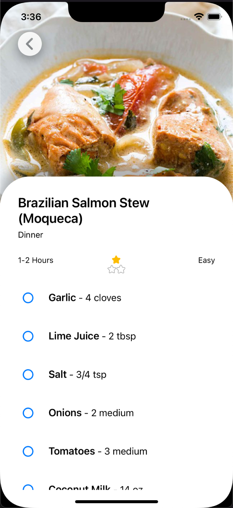

# InstaPrep

This Xamarin app has been created by Adam Lepley as part of a skills assessment for a potential project.

IOS support was the inital focus given the time constrains, so Android support is still very much in progress :)

## Known Issues
- SVGs not loading on Android
- Styling of the search bar on Android (need to implement platform  effect)
- App crashes when opening about page, likely custom renderer work is needed

# Screen Shots

Recipe Page             |  Recipe Detail Page|  About Page|  Resume Viewing / Sharing
:-------------------------:|:-------------------------:|:-------------------------:|:-------------------------:
  |  |  |  

# Link to Demo
https://www.screencast.com/t/j7fSqNOoXc

# Overview
The purpose of this exercise is to view how a candidate approaches designing and implementing a simple, but non-trivial Xamarin Forms application. This sample is designed to preview how a candidate tackles design as well to provide a working technical display. If the candidate requires an application idea, we recommend an application such as a file browser or an RSS feed, however, other ideas are warmly welcomed.

The applicant is expected to have the application available for display pending a final interview for discussion.

The applicant shall have one (1) week from the dispatch of the requirements to complete the sample application.

# Technical Requirements
- The sample application shall be written in C# using the Xamarin Forms framework.

- The application must contain at least one platform specific API (not using Xamarin
Essentials) used in the Forms Core project.

- The application must contain at least one example of each of the following: Renderer,
Converter, Effect, Behavior
Design Requirements
The sample app should contain a minimum of two pages: a list page providing a sortable, filterable and interact-able collection of some data, and a details page which will display all of the data for a selected cell.

- **List Page**
    - The List page is the page that is seen by the user after successfully logging into
the sample app. It will present a list of any data the app is displaying. Eg. If the
sample app is a file browser, it will show some directory root.

- **Details Page**
    - The details page is seen by the user upon selecting a cell in the list page. The details page will display all of the content returned by the sample dependency for the selected item.
